<div align="center">

# 🌾 Wheat Advisor

**Count wheat heads with YOLO11 on a GPU, then turn field photos, weather and soil into a plain-language condition report that a local LLM writes and plain code checks.**

[](https://github.com/srujansrutha/GWD-workflow/actions/workflows/ci.yml)


[](LICENSE)

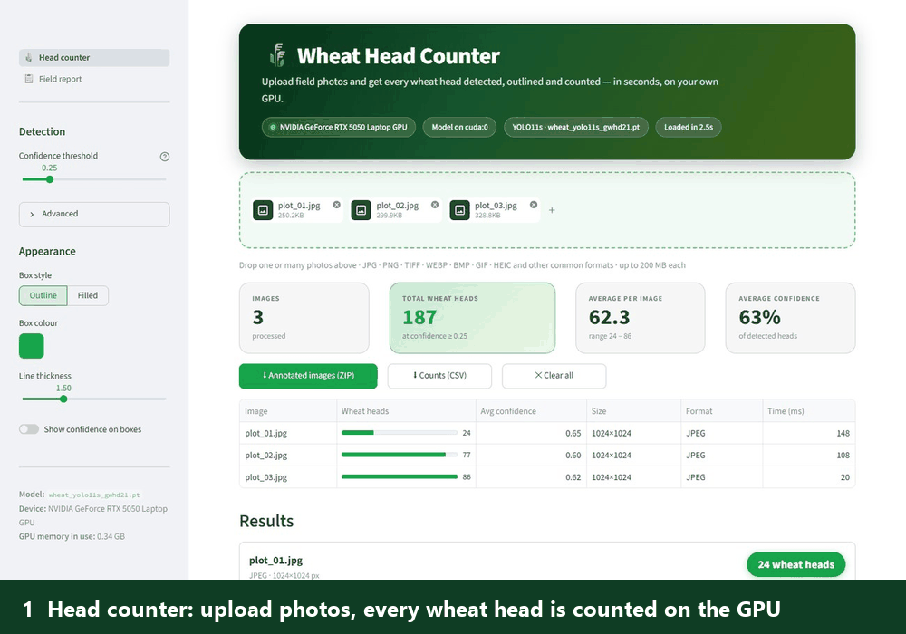

</div>

---

## What this is

A farmer or agronomist uploads photos of a wheat field and describes it (where, which crop, soil, history). The app counts the wheat heads, places every photo on a map, adds the weather since sowing, a short forecast and soil data, and writes a report: **how the field is doing, why, and what to do next.**

It is three pieces that share one codebase:

| Piece | What it does | Where |
| --- | --- | --- |
| **Detector** | A YOLO11 model trained on the Global Wheat Head Dataset, with leakage-safe, farm-level evaluation | [`notebooks/`](notebooks), [docs/TRAINING.md](docs/TRAINING.md) |
| **Head counter** | Streamlit page: upload one or many photos in any format, see detections and counts. The model is loaded onto the GPU once and stays there | [`frontend/counter_page.py`](frontend/counter_page.py) |
| **Field report** | Streamlit page backed by a **LangGraph** workflow and a **local Ollama model**. Photos in, a checked condition report and a chat out | [`frontend/report_page.py`](frontend/report_page.py), [docs/FIELD_REPORT.md](docs/FIELD_REPORT.md) |

## Highlights

- **Honest evaluation.** Two whole farms are held out of training, so the test score measures *unseen farms*, not a lucky random split. A second, harder test set (the official GWHD 2021 test farms) showed where the model really breaks, and more diverse training data, not a bigger model, fixed it.
- **The LLM explains; code decides.** Every number, verdict and action is computed by a rules engine into an *evidence packet*. The model only words it, and a **validator rejects** invented numbers, product names, spray doses, links, raw ids and unhedged predictions. A reply that fails gets one retry, then a rule-based fallback, so a user always gets a safe report.
- **Privacy by design.** Photos, the detector and the language model stay on the machine. Only a position rounded to about 1 km is sent to free weather, place-name and soil services (documented in [a table](docs/FIELD_REPORT.md#9-data-sources-and-what-leaves-this-machine)).
- **Uncertainty is part of the product.** Yield comes as a range, the weather forecast only drives advice for the next 5 days and never changes the verdict or the yield, and missing data lowers confidence instead of being guessed.
- **Engineered, not just prototyped.** LangGraph with parallel steps and early exits, GPU out-of-memory fallbacks, prompt-injection and HTML-escaping hardening, a time-zone-correct forecast with caching, and **116 automated tests** that need no GPU, network or language model.

## Tour of the app

### Head counter

Drop in one photo or a whole folder (JPG, PNG, TIFF, WebP, BMP, GIF, HEIC). Every head is outlined and counted, with a confidence slider that filters instantly without re-running the model, and ZIP/CSV downloads.

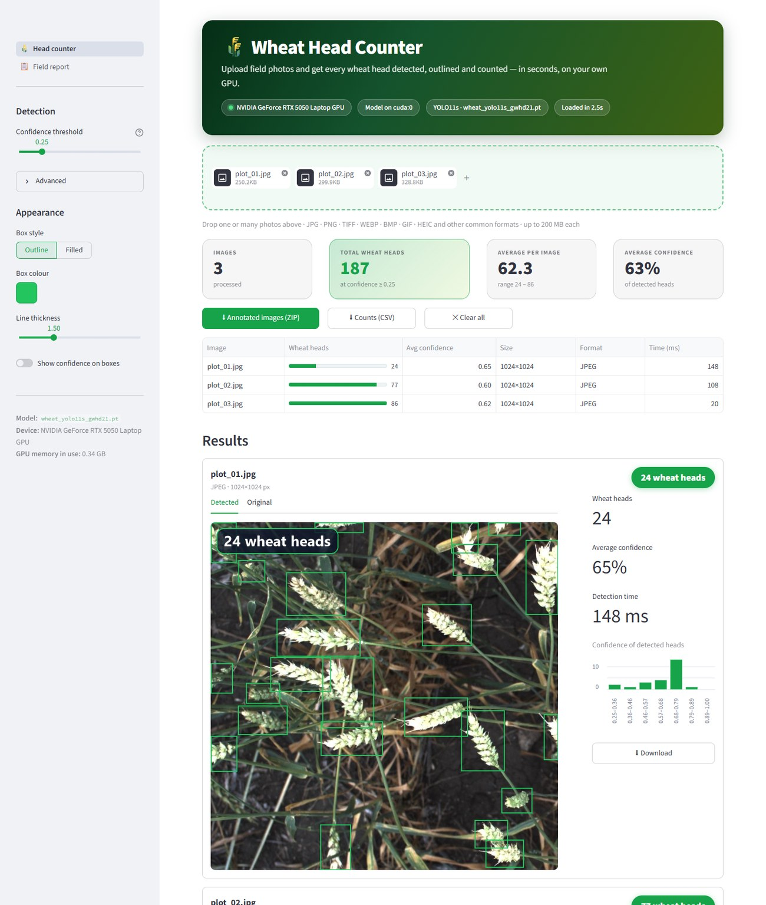

### Field report

Describe the field, upload the photos, pin the field and draw its boundary on a satellite map, and add soil results if you have them. Photo GPS is read from the files; the boundary gives the area and keeps photo points honest.

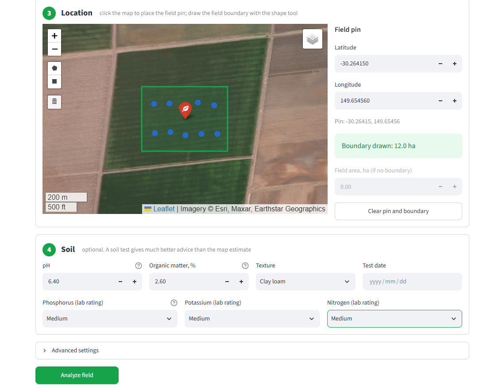

<details>
<summary>The first two steps of the form (field, crop and photos)</summary>

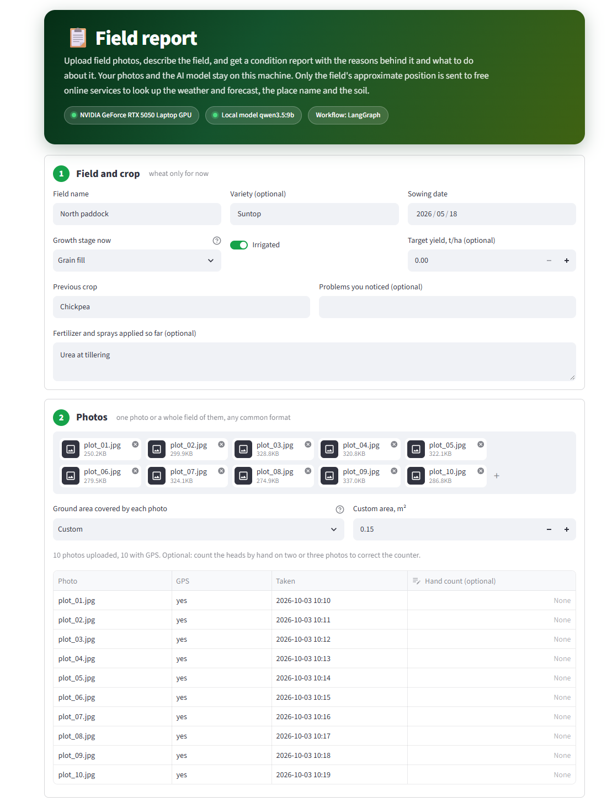

</details>

The report opens with a verdict, heads per m², a yield **range** (never a single made-up figure) and the reasons, each linked to its evidence.

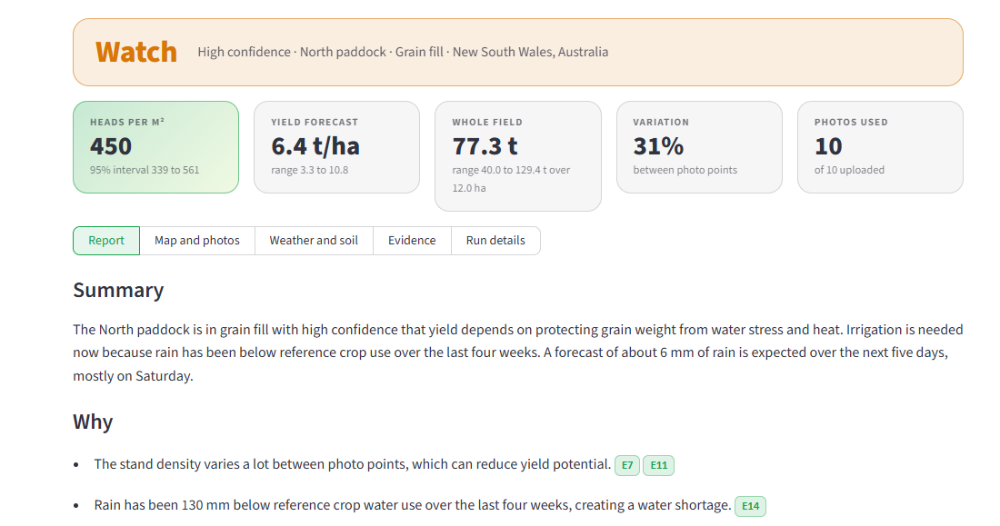

A short, clearly labelled look ahead turns the forecast into timing advice (irrigate now, wait for rain, a heat or disease warning). It never changes the verdict or the yield range.

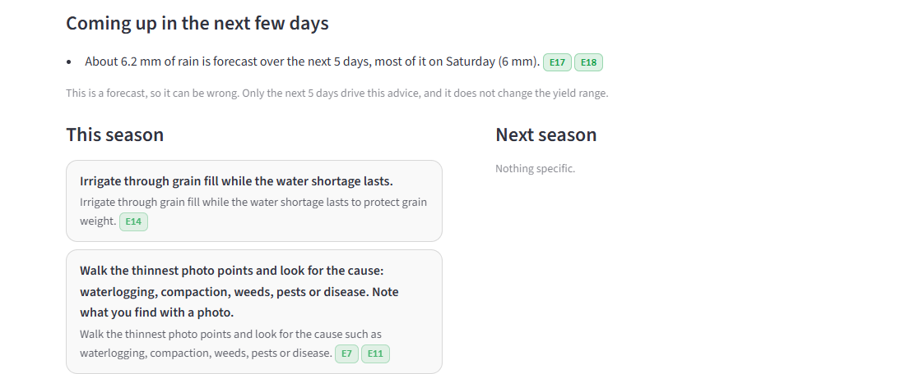

Photo points are coloured by head density, so weak zones show up on the map. Each photo keeps its detections and a heads per m² figure.

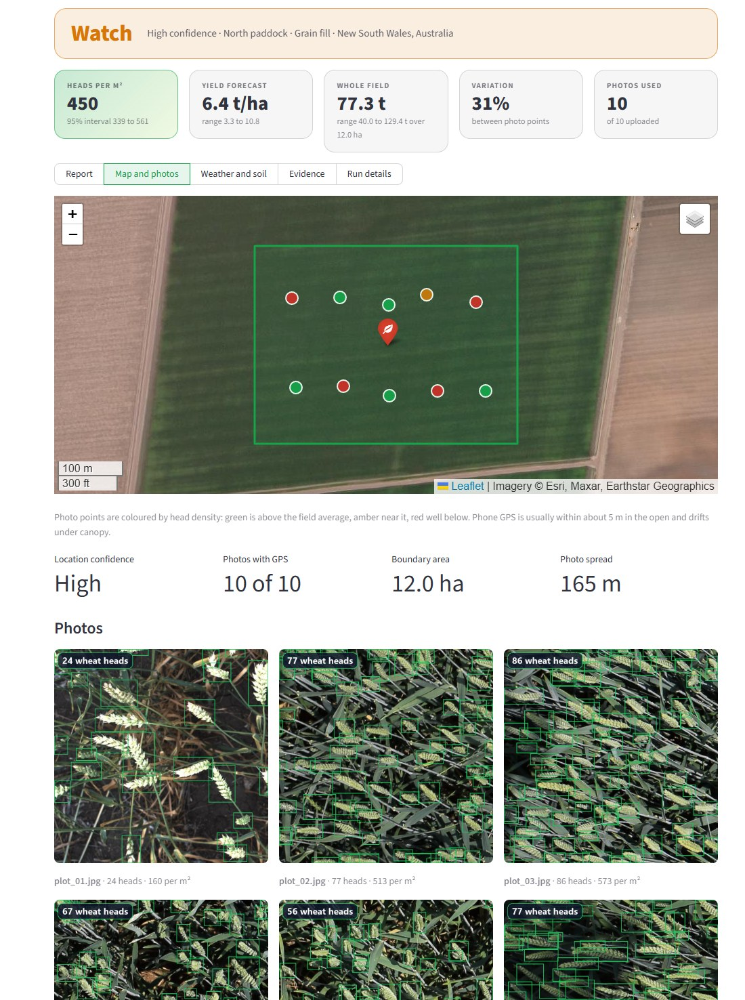

Weather since sowing, and the 7-day forecast (the last two days are marked *less certain* and are not used for advice).

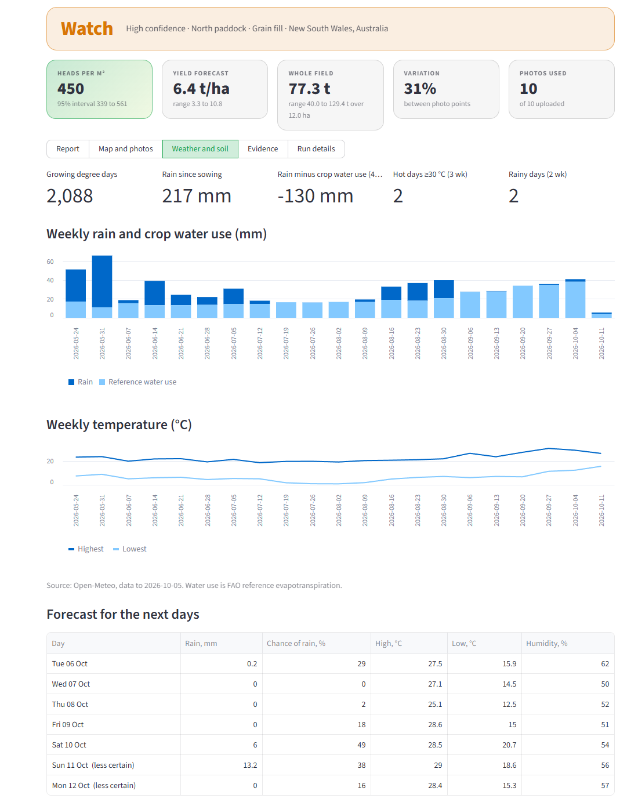

<details>
<summary>Evidence and run details (how every number is traced, and what the workflow did)</summary>

Every number in the report comes from this evidence list. The model may cite the ids but cannot add figures.

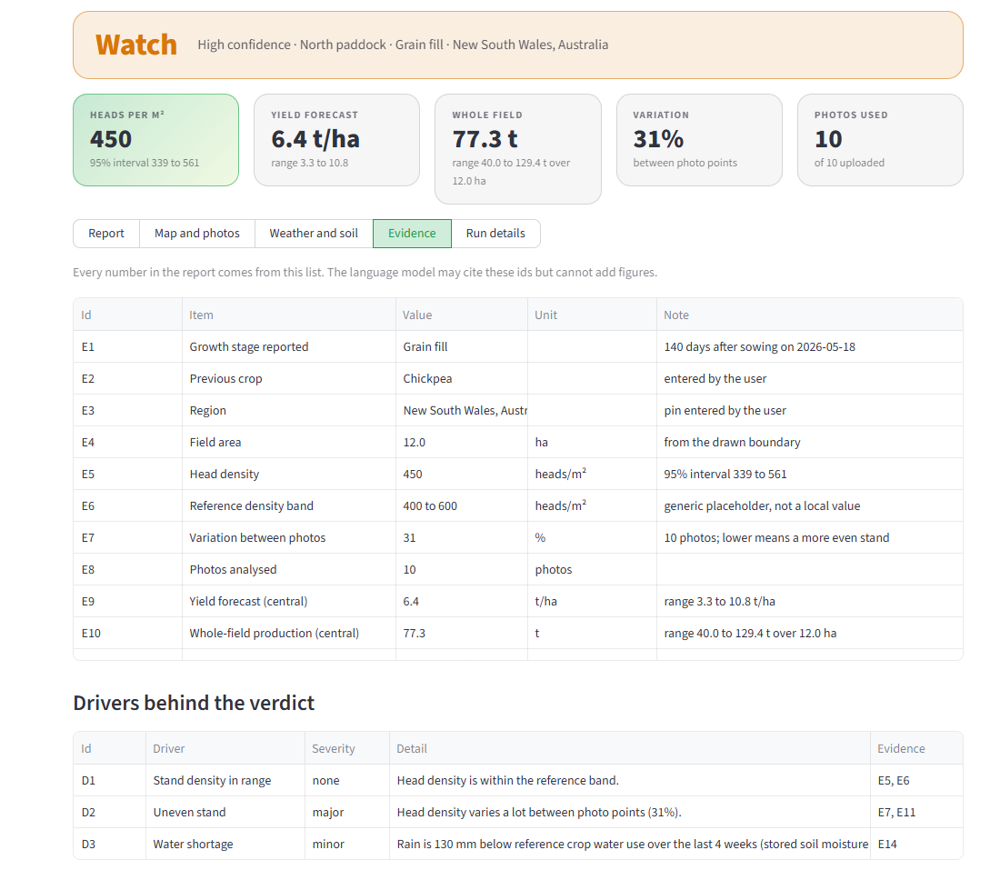

The run details show the model, attempts, tokens, any checks the first draft failed, and the time per LangGraph step.

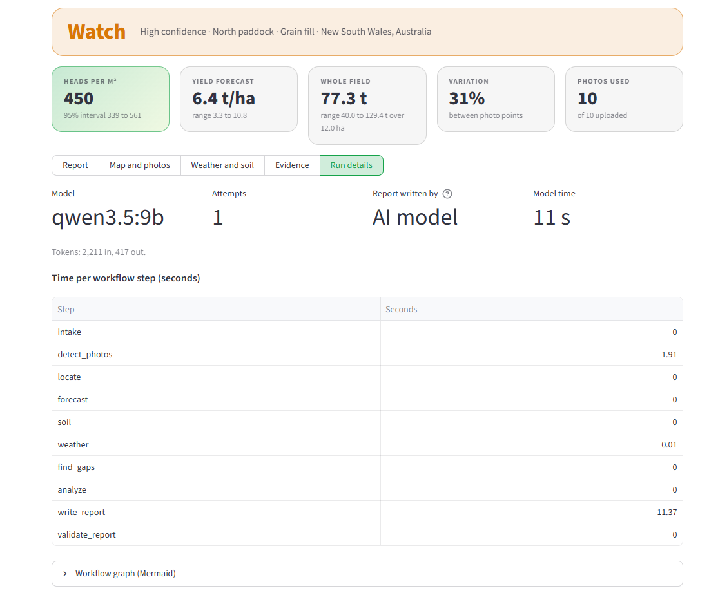

</details>

A chat under the report answers questions from the report's own facts, and turns your replies to the open questions into form updates.

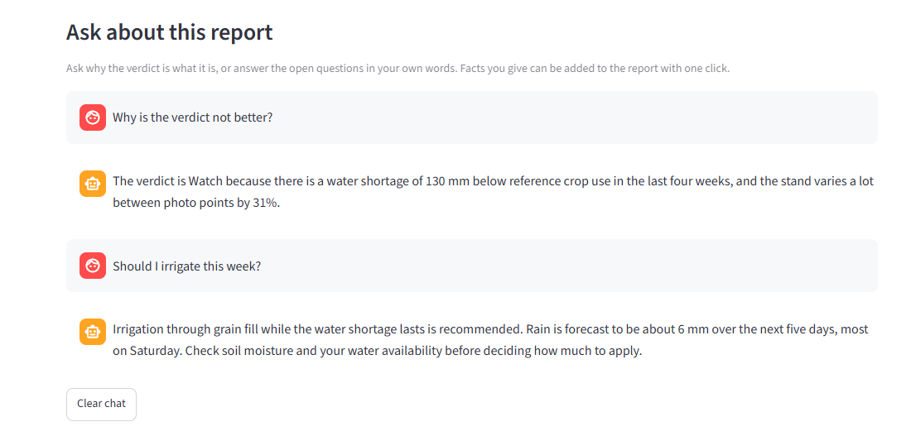

> The photos are real wheat images from the Global Wheat Head Dataset, given demo GPS tags in a paddock near Narrabri, Australia. The report text is real model output from one run; wording varies between runs.

## How the report stays trustworthy

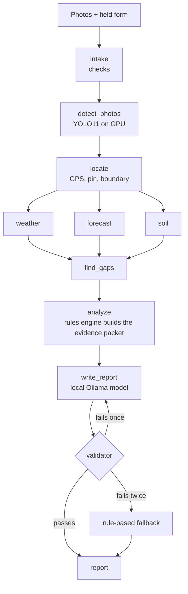

The agronomy engine is ordinary code. It creates numbered **evidence** (`E1`, `E2`, …), **drivers** (what makes the field good or poor) and **candidate actions**, then decides the verdict and confidence. The language model sees only that packet. The validator then rejects a reply that:

| Rejected when the reply… | Why |
| --- | --- |
| contains a number that is not in the packet | no invented figures |
| names a pesticide or gives an application rate (`120 kg/ha`, `20 bags per hectare`, …) | products and doses are a licensed advisor's call |
| cites an unknown evidence id, or leaves out a required action | every statement stays traceable |
| contains a link, HTML, a raw id or a technical field name | plain text only, no outside content |
| talks about coming days as certain (a weekday, "tomorrow", "next five days" with no *forecast* or *expected*) | predictions must sound like predictions |

What the validator **cannot** check is whether every phrase of prose is true, so poor verdicts and low-confidence reports are flagged for agronomist review. Details, measured reliability and limits: [docs/FIELD_REPORT.md](docs/FIELD_REPORT.md).

## Results

All scores use the same protocol: no test-time augmentation, each model at its own image size. `val` is a random 10% of the training farms, `test` is two farms held out entirely, `test2` is the official GWHD 2021 test farms (1,380 images, never trained on).

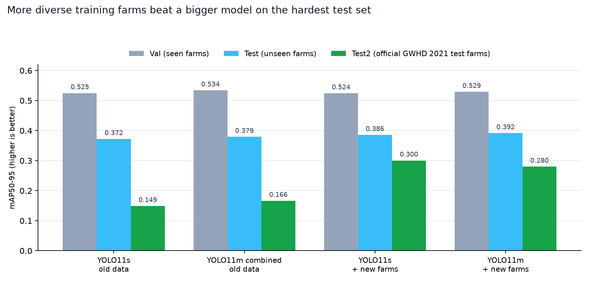

| Model | Trained on | Val | Test | Test2 |
| --- | --- | ---: | ---: | ---: |
| YOLO11s | old data | 0.5248 | 0.3720 | 0.1487 |
| YOLO11m combined (1280 px, balanced sampling, extra augmentation) | old data | 0.5340 | 0.3791 | 0.1662 |
| **YOLO11s** | old + 1,707 new-farm images | 0.5243 | 0.3855 | **0.3005** |
| YOLO11m | old + 1,707 new-farm images | 0.5289 | **0.3916** | 0.2799 |

- Five changes at once (bigger model, higher resolution, longer training, balanced sampling, more augmentation) cost about 9 hours and added little on unseen farms. **More diverse farms doubled the `test2` score** with the same small model.
- The deployed model is the YOLO11s trained on all the data. Counting error at the app's default confidence is about **5 to 6% (median) on familiar farms and 13% on farms from other countries**, where it tends to undercount by about 14%, so reports show ranges and let users correct the counter with hand counts.
- Test-time augmentation helped one model and hurt another, so it is off by default. The full analysis, every setting, the metrics explained and the dead ends are in [docs/TRAINING.md](docs/TRAINING.md) and [docs/METRICS.md](docs/METRICS.md).

On an 8 GB RTX 5050 laptop GPU the counter takes about 20 to 150 ms per 1024 × 1024 photo, and a full field report (10 photos, weather, forecast, soil, model, validation) takes about 15 to 25 seconds with `qwen3.5:9b` fully on the GPU.

## Quick start

> **The trained detector (19 MB) is not in the repository** (model files are kept out of Git). Download it from the [v1.0 release](https://github.com/srujansrutha/GWD-workflow/releases/tag/v1.0), or train your own with the notebooks ([docs/TRAINING.md](docs/TRAINING.md#10-reproducing-the-project)), or point `WHEAT_MODEL` at any YOLO weights. The tests and the whole workflow logic run without it. Licence and checksum: [Detector weights](#detector-weights).

```bash
git clone https://github.com/srujansrutha/GWD-workflow.git
cd GWD-workflow

python -m venv .venv
.venv\Scripts\activate            # Linux/macOS: source .venv/bin/activate
pip install -r requirements.txt   # for a GPU, install a CUDA build of PyTorch first (pytorch.org)

ollama pull qwen3.5:9b            # the report writer (needs a recent Ollama)

# the detector weights, from the release (or: set WHEAT_MODEL=path\to\best.pt)
mkdir weights
curl -L -o weights/wheat_yolo11s_gwhd21.pt https://github.com/srujansrutha/GWD-workflow/releases/download/v1.0/wheat_yolo11s_gwhd21.pt

frontend\run_app.bat              # Linux/macOS: ./frontend/run_app.sh
```

Open <http://localhost:8501>. The detector loads onto the GPU the first time a page is opened and stays there until you stop the app. Without Ollama the report still works, using the rule-based wording.

Run the tests (about 3 seconds, no GPU, network or model needed):

```bash
python -m pytest
```

## Run with Docker

[compose.yaml](compose.yaml) runs the app and its language model as separate containers, the same way a website splits frontend and backend:

| Container | Kind | What it does |
| --- | --- | --- |
| `app` | service, keeps running | The Streamlit app: detector, LangGraph workflow and both pages, on port 8501 |
| `ollama` | service, keeps running | The local LLM server. Downloaded models live in a Docker volume, not in an image |
| `ollama-pull` | one-shot job | Downloads `qwen3.5:9b` (about 6.6 GB) the first time, then exits |

The image holds only code and libraries ([docker/app.Dockerfile](docker/app.Dockerfile), built from [requirements-app.txt](requirements-app.txt)). The trained weights are **mounted** from `weights/` read-only, so put `wheat_yolo11s_gwhd21.pt` there first.

There is no ready-made image to `docker pull`: Docker **builds** the app image on your computer from this repository (the Ollama containers use the public `ollama/ollama` image). You choose one of the two commands below; Docker does not try the GPU one first and fall back. [compose.gpu.yaml](compose.gpu.yaml) only adds the GPU on top of [compose.yaml](compose.yaml), and it is separate because a GPU request makes Docker refuse to start on a computer with no NVIDIA GPU.

```bash
# NVIDIA GPU (Docker Desktop with WSL 2, or the NVIDIA Container Toolkit on Linux)
docker compose -f compose.yaml -f compose.gpu.yaml up --build

# CPU only: works anywhere, but the report model is slow without a GPU
docker compose up --build
```

`up` starts the containers, and `--build` builds the app image first if it is missing or the code changed. Open <http://localhost:8501>. The first start builds the image and downloads the report model, so it takes a while; check progress with `docker compose ps -a` and `docker compose logs -f`. The port is bound to this computer only, because the app has no login.

**Every command, the settings, disk use, cleanup and fixes for common errors are in [docs/DOCKER.md](docs/DOCKER.md).**

Already running Ollama on your computer? Skip the Ollama containers and point the app at it:

```bash
ADVISOR_OLLAMA_URL=http://host.docker.internal:11434 docker compose up --build --no-deps app
# PowerShell: $env:ADVISOR_OLLAMA_URL="http://host.docker.internal:11434"; docker compose up --build --no-deps app
```

If the app says Ollama is not running, the host's Ollama is probably listening on `localhost` only: start it with `OLLAMA_HOST=0.0.0.0` (or turn on "Expose Ollama to the network" in its settings), ideally behind a firewall, because Ollama has no password.

The model is only downloaded when it is missing, so a newer upstream version never replaces the tested one by surprise. Update it on purpose with `docker compose exec ollama ollama pull qwen3.5:9b`. Stop everything with `docker compose down`; the model volume stays, and `docker compose down -v` removes it too.

The CPU image is about 3 GB (most of it PyTorch); the GPU image is larger because it carries the CUDA libraries. Rebuild now and then with `docker compose build --pull` to pick up security fixes in the Debian base image. CI builds the image and checks that the app starts on every push.

## Data sources and libraries

Some parts are **libraries** you install with `pip`. Others are **online services** the app asks over the internet while it runs. No API keys are needed.

| What | Used for | Kind |
| --- | --- | --- |
| [Folium](https://python-visualization.github.io/folium/) (built on Leaflet.js) and `streamlit-folium` | The interactive map, the field pin and drawing the boundary | Python libraries |
| Esri World Imagery, OpenStreetMap | Satellite (default) and street map tiles | Online services |
| [Open-Meteo](https://open-meteo.com) archive and forecast | Weather since sowing and the next 7 days (rain, chance of rain, temperature, humidity, crop water use) | Online service |
| OpenStreetMap Nominatim | Place name for the pin | Online service |
| ISRIC SoilGrids | Soil estimate when no soil test is entered | Online service |
| `requests` | Makes the calls to those services | Python library |

The forecast is Open-Meteo's own; this project does not train or run a weather model. It only turns those numbers into timing advice for the next 5 days. Only the field's position, rounded to about 1 km, is sent. The map, weather and forecast need internet; counting heads and writing the report do not (without weather the report skips the weather checks).

## Repository layout

```text
.
├── frontend/
│   ├── app.py, common.py            Streamlit router and the shared GPU model
│   ├── counter_page.py              Head counter page
│   ├── report_page.py               Field report page
│   ├── wheat_detector.py            YOLO wrapper: GPU residency, OOM fallbacks, any image format
│   ├── advisor/
│   │   ├── graph.py                 LangGraph workflow
│   │   ├── engine.py                Rules engine and evidence packet (plain code)
│   │   ├── llm.py                   Prompt, validator, rule-based fallback
│   │   ├── chat.py                  Chat about the report and fact extraction
│   │   ├── weather.py, geo.py, soil.py   Weather and forecast, GPS and geometry, soil
│   │   └── config.py, schemas.py, knowledge.py
│   └── tests/test_advisor.py        116 tests
├── notebooks/                       Data preparation, training and evaluation
├── docs/                            Guides (below) and screenshots
├── docker/app.Dockerfile           The app image (code and libraries only)
├── compose.yaml, compose.gpu.yaml   The app and Ollama containers, CPU or NVIDIA GPU
├── requirements-app.txt             What the app needs to run (used by the image)
├── requirements.txt, ruff.toml, pytest.ini
└── .github/workflows/ci.yml         Lint, tests and a Docker build on every push
```

| Document | What is in it |
| --- | --- |
| [docs/FIELD_REPORT.md](docs/FIELD_REPORT.md) | The report workflow, validation, forecast logic, chat, privacy table, model choice and limits |
| [docs/DOCKER.md](docs/DOCKER.md) | Running with Docker: what each container does, which command to use, every command explained, settings, cleanup, troubleshooting |
| [docs/TRAINING.md](docs/TRAINING.md) | The training guide: dataset, split design, every setting and why, experiments, problems met |
| [docs/METRICS.md](docs/METRICS.md) | Detection and counting metrics explained, with this project's numbers |
| [docs/field_advisor_plan.html](docs/field_advisor_plan.html) | The original plan and design reasoning (open the file in a browser) |

## Known limits

- **Agronomy values are generic placeholders** (reference head density, kernels per head, grain weight, soil and weather thresholds). They need local values per region and variety before real advice.
- The free **SoilGrids** service often returns nothing, so soil advice then asks for a soil test instead of guessing.
- The forecast covers the next 5 days and is not used for the yield range. Frost, wind and storm warnings are not covered.
- The validator checks numbers, products, doses and wording rules, not every claim in the prose.
- Not built yet: satellite vegetation zones, PDF export, accounts and a database. It is a single-user, single-machine app.

## Detector weights

`wheat_yolo11s_gwhd21.pt` is the deployed detector: YOLO11s fine-tuned from Ultralytics' pretrained YOLO11s on the old data plus 1,707 new-farm images (the row marked in bold under [Results](#results)). It is attached to the [v1.0 release](https://github.com/srujansrutha/GWD-workflow/releases/tag/v1.0), not stored in Git.

| | |
| --- | --- |
| Size | 19,261,210 bytes (19 MB) |
| SHA-256 | `2eea0ca6d93953707847ac56198d2a501af6a8e2152a1694ac5a7d6eb1264b3a` |
| Check it | `sha256sum weights/wheat_yolo11s_gwhd21.pt` (Linux, macOS) or `Get-FileHash weights\wheat_yolo11s_gwhd21.pt` (PowerShell) |
| Licence | **AGPL-3.0.** It is derived from Ultralytics YOLO11, which is AGPL-3.0 (Ultralytics also sells an Enterprise licence for commercial use). Treat the weights as AGPL-3.0, not MIT, even though the code here is MIT. |
| Data credit | Trained on the Global Wheat Head Dataset (see Credits below). Please cite David et al. if you reuse the weights |

## Credits and licence

- **Data:** Global Wheat Head Dataset, David et al., *Plant Phenomics* 2020 ([Zenodo release](https://zenodo.org/records/4298502), MIT licence; the training data came from the Kaggle *Global Wheat Detection* copy of it) and *Global Wheat Head Dataset 2021: more diversity to improve the benchmarking of wheat head localization methods*, arXiv:2105.07660, [DOI 10.5281/zenodo.5092309](https://doi.org/10.5281/zenodo.5092309) (CC BY 4.0). The demo photos in the screenshots come from this data.
- **Detector:** [Ultralytics YOLO11](https://github.com/ultralytics/ultralytics) (AGPL-3.0). **Workflow:** [LangGraph](https://github.com/langchain-ai/langgraph). **Local LLM:** [Ollama](https://ollama.com) with `qwen3.5:9b`.
- **Online lookups:** weather and forecast by [Open-Meteo](https://open-meteo.com), place names from OpenStreetMap Nominatim, soil estimates from ISRIC SoilGrids, satellite basemap by Esri.
- The code in this repository is released under the [MIT licence](LICENSE). Dependencies keep their own licences (note that Ultralytics is AGPL-3.0).

Built by **J Srujan Vishwakarma** ([@srujansrutha](https://github.com/srujansrutha)).
