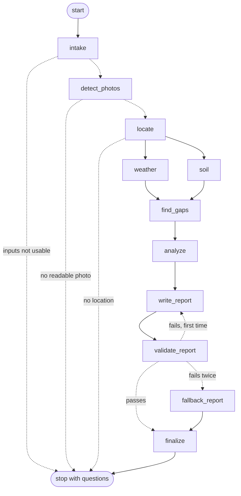

# Field Report: how it works

The **Field report** page of the Wheat Advisor app turns field photos plus a short form into a condition report: how the crop is doing, why, and what to do about it. It runs entirely on this machine. A LangGraph workflow orchestrates the steps, the YOLO11s counter finds the wheat heads on the GPU, and a local Ollama model writes the wording.

Plan and diagrams: https://claude.ai/artifact/7oN5kNStUaM7LhF7ReNfeK (private to the owner).

## 1. Run it

```powershell
# one-time: a recent Ollama (0.35.1 was used; 0.15.2 was too old for this model) and the model
ollama pull qwen3.5:9b

frontend\run_app.bat      # opens http://localhost:8501 ; pick "Field report" in the sidebar
```

Settings are environment variables (defaults in `frontend/advisor/config.py`):

| Variable | Default | Meaning |
|---|---|---|
| `ADVISOR_MODEL` | `qwen3.5:9b` | Ollama model used for the report text |
| `ADVISOR_NUM_CTX` | `6144` | Context window; see section 6 for why not larger |
| `ADVISOR_KEEP_ALIVE` | `10m` | How long Ollama keeps the model in GPU memory when idle. `-1` keeps it loaded forever |
| `ADVISOR_FORCE_FALLBACK` | off | `1` skips the language model and uses the rule-based wording |
| `OLLAMA_HOST` | `http://localhost:11434` | Where Ollama listens |

If Ollama is stopped or the model is missing, the page says so and still produces a report using the rule-based wording.

## 2. What you enter

| Step | Inputs |
|---|---|
| Field and crop | name, variety, sowing date, growth stage, irrigated or not, previous crop, inputs applied, problems noticed, target yield |
| Photos | one or many photos in any common format, the ground area each photo covers (a 50 × 50 cm frame is 0.25 m²), optional hand counts on two or three photos |
| Location | click the map to drop a pin, draw the field boundary (polygon or rectangle), or rely on the GPS stored in the photos |
| Soil | optional: pH, organic matter, texture, and the lab's own Low / Medium / High rating for P, K and N |
| Advanced | counting confidence, kernels per head, grain weight, reference head density |

Phosphorus, potassium and nitrogen are entered as the **lab's rating** on purpose. Test units and methods (Olsen, Bray, Mehlich, ppm, kg/ha) differ too much to interpret a bare number safely.

## 3. The workflow



The raw export from LangGraph is in [field_report_graph.mmd](field_report_graph.mmd).

| Step | What it does | Can it stop the run? |
|---|---|---|
| `intake` | Checks the form: photos present, sowing date sensible, heads visible at the chosen stage | Yes. Before heading, a head count means little, so it asks the user to come back or fix the stage |
| `detect_photos` | Decodes each photo, counts heads on the GPU, reads GPS and time, checks sharpness and brightness, draws the boxes | Yes, if no file is readable. Unreadable files are skipped with a message |
| `locate` | Finds the field: pin, else median of photo GPS. Compares with the boundary, reverse-geocodes the region | Yes, if there is no pin and no GPS |
| `weather`, `soil` | Run **in parallel**. Weather from Open-Meteo, soil from the user's test (SoilGrids map as a fallback) | No. A failure becomes a gap |
| `find_gaps` | Lists what is missing or doubtful in plain words | No |
| `analyze` | The agronomy engine (plain code) builds the evidence packet, drivers, candidate actions, verdict and confidence | No |
| `write_report` | The local model explains the packet as JSON | No |
| `validate_report` | Code checks the reply (section 5). A failure loops back once with the list of problems | No |
| `fallback_report` | Rule-based wording from the same packet | No |
| `finalize` | Assembles the report | No |

## 4. How the field is located

1. Read GPS, accuracy and time from each photo's metadata.
2. The pin the user placed wins; otherwise the median of the photo GPS points is used.
3. If a boundary is drawn, each photo point is tested against it and the area in hectares is computed.
4. Confidence is **high** when at least 80% of GPS photos fall inside the boundary, or a pin has three or more photos agreeing within 1.5 km. **Medium** with a pin or any GPS. A missing location stops the run.
5. The region (village, state, country) comes from OpenStreetMap Nominatim.

Phone GPS is usually within about 5 m in the open and drifts under canopy. Messaging apps strip GPS, so original files must be uploaded. The map shows the satellite layer by default.

## 5. How the report stays honest

The agronomy engine ([engine.py](../frontend/advisor/engine.py)) is ordinary code. It produces:

- **Evidence** items (`E1`, `E2`, …): every number, with a unit and a note.
- **Drivers** (`D1`, …): what makes the field good or poor, each with a severity (0 none, 1 minor, 2 major) and the evidence behind it.
- **Candidate actions** (`A1`, …): the only actions the report may recommend, each marked "confirm with an agronomist" where it touches fertilizer, spraying or soil correction.
- **Verdict** (Good, Watch, Poor): Poor if two major drivers or a total severity of 5; Watch for one major or a total of 2; otherwise Good.
- **Confidence**: starts at 100 and loses points for few photos, unknown photo area, missing weather, no soil test, unconfirmed location.

The model only explains this packet. The validator ([llm.py](../frontend/advisor/llm.py)) rejects a reply that:

| Check | Why |
|---|---|
| does not match the JSON schema | the page layout depends on it |
| cites an unknown evidence or action id | no invented evidence or actions |
| writes a raw id like `E3` inside a sentence | ids belong in the id lists |
| contains a number that is not in the packet | no invented figures |
| names a pesticide or active ingredient | products are a licensed advisor's decision |
| gives an application rate (kg/ha, L/ha, …) | no doses. A yield in t/ha is allowed when it matches a packet figure |
| omits a required action or ignores a major driver | the important points must appear |

If a reply fails, the model gets the list of problems and one more try. After two failures the rule-based wording is used, so a user always gets a safe report. The **Run details** tab shows the model, attempts, tokens, the failures and the time per step.

**What the validator cannot check:** it does not judge every phrase of prose. In testing, the model once added the unsupported remark "relies on stored soil moisture" to a summary. Poor verdicts and low-confidence reports are therefore flagged for agronomist review, and every statement links to its evidence chips.

## 6. Choosing the model (this machine: 8 GB RTX 5050, 23 GB RAM)

The aim was the strongest recent model that stays **fully on the GPU** next to the counter model (about 0.4 GB), supports JSON-schema output, and follows a "use only these facts" instruction.

| Candidate (Ollama library, checked October 2026) | Download | Fits 8 GB | Notes |
|---|---:|---|---|
| **qwen3.5:9b** | 6.6 GB | Yes | Newest Qwen family; tools, thinking, vision; chosen |
| qwen3.5:4b | 3.4 GB | Easily | Smaller fallback if memory is needed elsewhere |
| gemma4:e4b | 6.6 GB | Tight | Not benchmarked here |
| gemma4:12b, qwen3.5:27b | 8.0 GB, 17 GB | No | Too big for the card |
| llama3.2:3b (already installed) | 2.0 GB | Yes | Tested first: needed a retry because it wrote ids inside a sentence, and its wording was weaker |

`qwen3.5:9b` was **not** compared head to head with `gemma4:e4b` or `qwen3.5:4b`; it was chosen as the largest model of the newest family that fits, then measured:

| Context window | On GPU | Speed | Result |
|---|---|---|---|
| 8192 | 88% (12% spilled to CPU) | 18.6 tokens/s | passed |
| 6144 | 100% (5.6 GB) | n/a | fits, **used as default** |
| 4096 | 100% (5.5 GB) | 23.8 tokens/s | passed |

Reliability on three field situations (healthy, heat plus wet spell at flowering, thin and uneven on acid soil), three runs each: **9 of 9 passed validation on the first try**, median **10 s** per report, about 53 tokens/s when the model was warm. The first request after the model was idle took about 36 s extra to load it. A full run in the browser (11 photos, weather, report) took about 15 s.

Ollama must be recent: version 0.15.2 refused to pull this model ("requires a newer version"), and 0.35.1 works. Thinking is switched off for these structured replies to save time.

## 7. Data sources

| Data | Source | Notes |
|---|---|---|
| Weather (daily temperature, rain, evapotranspiration) | Open-Meteo archive and forecast | Free without a key. Check its terms before commercial use |
| Region name | OpenStreetMap Nominatim | Usage policy: identify the app, about one request per second. Results are cached |
| Soil estimate | ISRIC SoilGrids (250 m) | The public service often returns empty values. In testing it returned nothing for a farm point in Australia and for Iowa. The app then asks for a soil test instead of guessing |
| Satellite basemap | Esri World Imagery | For display only. Check Esri's terms for your use |

## 8. Known limits and what is not built

- **No satellite vegetation index yet** (Sentinel-2 NDVI zones). Photos are the only direct measure of the crop.
- **No PDF export.** The report downloads as Markdown, with the evidence as JSON.
- **Agronomy values are generic placeholders**: the reference head-density band (400 to 600 per m²), kernels per head, grain weight, and the soil and weather thresholds. Replace them with local values per region and variety. See `config.py` and `engine.py`.
- **Heads appear late.** From heading onward most nitrogen and seeding decisions are made, so advice is split into this season and next season, and nothing prescribes fertilizer doses or sprays.
- **The counter has known error**: about 5% typical on photos like its training set, and about 13% (undercounting by around 14%) on unfamiliar farms. Hand counts on two or three photos correct it.
- **Single user, single machine.** No accounts, queue or database yet.
- A photo's ground area must be supplied. Without it the report shows counts only.

## 9. Tests

```powershell
cd frontend
..\.venv\Scripts\python -m pytest tests -q
```

20 tests run in about 3 seconds with no GPU, network or language model: EXIF and geometry, the yield formula, calibration, the verdict logic, the validator's rejections (invented numbers, products, doses, raw ids, unknown ids), the fallback wording passing its own validator, and the whole LangGraph flow with the detector, weather and geocoder stubbed.

## 10. Files

| Path | Purpose |
|---|---|
| `frontend/report_page.py` | The Field report page |
| `frontend/advisor/graph.py` | LangGraph workflow |
| `frontend/advisor/engine.py` | Agronomy engine and evidence packet |
| `frontend/advisor/llm.py` | Ollama call, validator, fallback |
| `frontend/advisor/geo.py`, `weather.py`, `soil.py` | Location, weather and soil |
| `frontend/advisor/schemas.py`, `config.py`, `knowledge.py` | Inputs, settings, stage notes |
| `frontend/common.py` | Shared GPU detector and styling |
| `frontend/tests/test_advisor.py` | Test suite |
